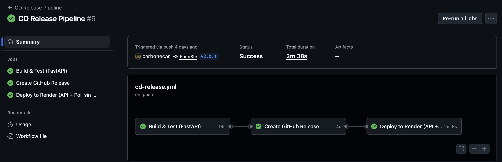
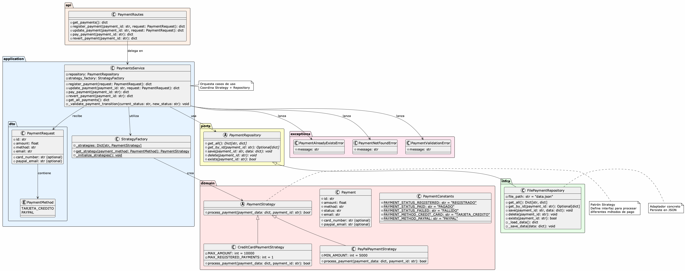
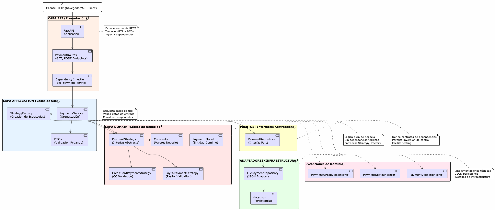
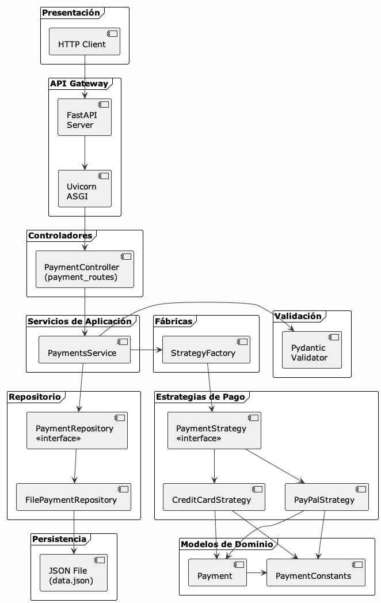
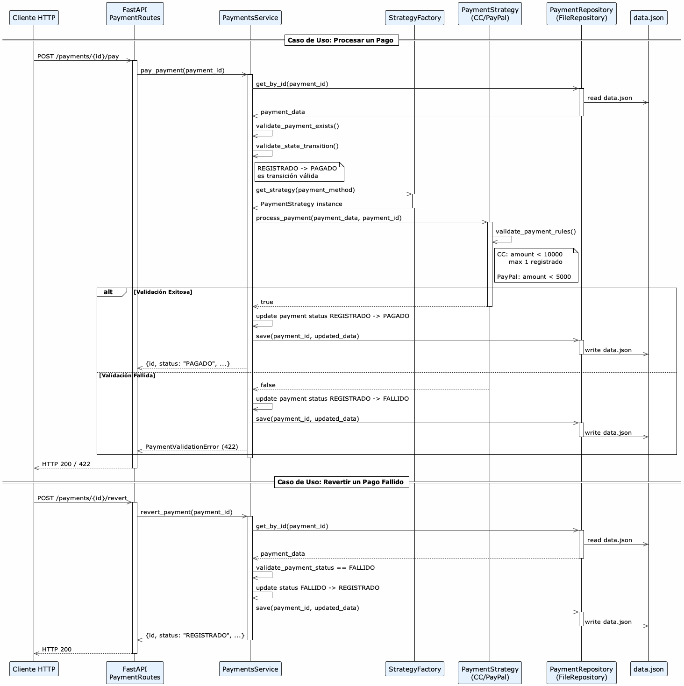
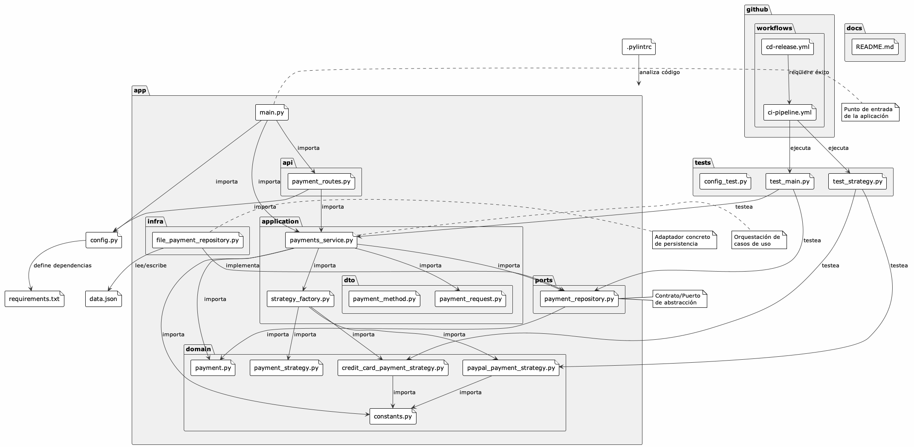
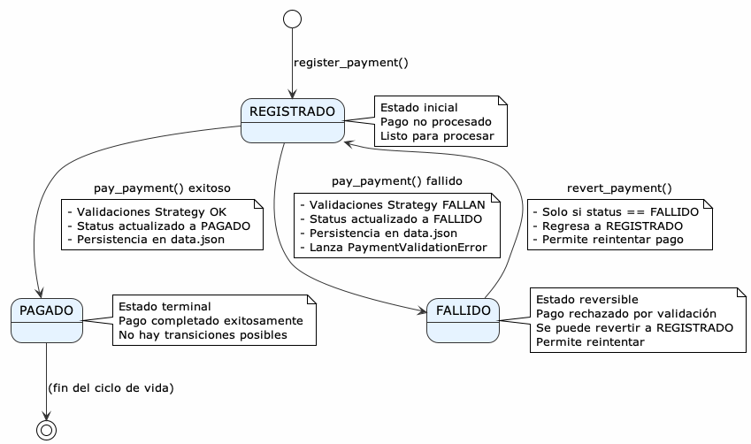
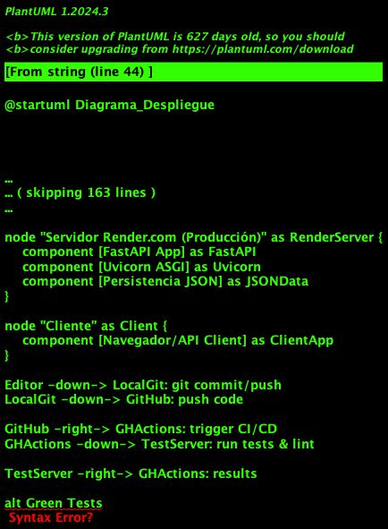
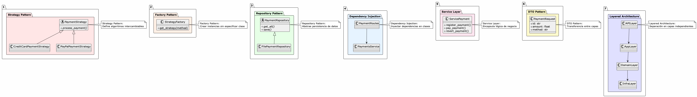

### Creación de repositorio

 gh repo create parcial_grupo_5 --public --source=. --remote=origin

### Deploy automático
El deploy automático se hace al taguear y se genera mediante la api de render
    - Crear el tag
 ``` git tag -a v1.0.0 -m 'primer version```
 ``` git push origin v1.0.0 ``
 `
Se deshabilita el autodeploy y queda habilitado para deployar cuando se hace un tag

Flujo de trabajo: 
- Se genera el branch y el pr
- Se ejecutan los pipelines de CI
- Cuando se genera el merge a main se vuelve a ejecutar el pipeline de CI
- Cuando se taguea se deploya automaticamente
- Se incluye pylint para el análisis de código estatico

La api queda deployada en https://parcial-grupo-5.onrender.com/docs




#### Para deployar se agregan las credenciales en github como secret

- Agregar las secrets a github 
 - RENDER_API_KEY ``` gh secret set RENDER_API_KEY --body "tu_api_key_de_render" ```
 - RENDER_SERVICE_ID ``` gh secret set RENDER_SERVICE_ID --body "tu_service_id_de_render" ```

Observacion: Si el servicio esta bajo. Hacer un tag y deployar
### Ejecutar la aplicacion local
 en el direcotrio raiz ejecutar:
 
 ```fastapi dev app/main.py```
 o bien 

 ``` uvicorn app.main:app --reload --port 8000 ```

### Decisiones de diseño. 
- Usamos strategy para implementar la lógica de cada uno de los tipos de pago.
    - Objetivo: desacomplar la lógica de negocio en diferntes clases
- Para obtener las strategies usamos factory.
  - Objetivo: Desacomplar la lógica de creación y búsqueda de las estrategias en otra clase. 

#### Arquitectura
Se usa una arquitectura en capas que toma del patron hexagonal la division de puertos e infra. 
No hay un framework de IOC y se crean las dependencias a través de factories en la capa de applicaion
No se modela el dominio por falta de tiempo y deberían abstrarse los DTO en cada capa también
- api: capa que expone la interfaz
- application: donde se orquestan los los casos de uso
- dominio: objetos de dominio y lógica de negocio
- ports: interfaces para comunicarse con la persistencia
- infra: implementaciones
 


 ### Test
 Se corren automaticamente o con el comando ``` pytest ```

 Para levantar la api local solo se necesita hacer ``` fastapi dev main.py ```


### Diagramas de Arquitectura

#### Documentación Completa
[Guía de Diagramas UML](./docs/GUIA_DIAGRAMAS_UML.md)

#### Diagramas PNG
#### Diagrama de clases

#### Diagrama de Arquitectura

#### Diagrama de componentes

#### Diagrama de secuencia

#### Diagrama de paquetes

#### Estados

#### Despliegue

#### Patrones



### Supuestos
Como en el enunciado no lo declara no se supone que existe un flujo entre los estados, salvo el descripto en las operaciones
por lo tanto no se implementa una máquina de estados para validar las transiciones

